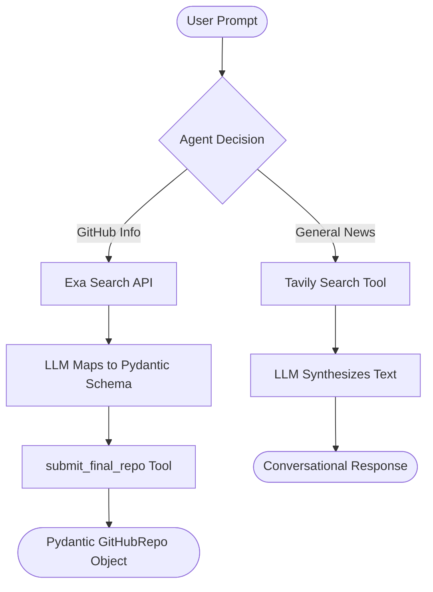

# LangGraph ReAct Agent Chatbot

A highly optimized, asynchronous AI agent built using **LangGraph**, **LangChain**, and **Pydantic**. The chatbot acts as a general-purpose AI assistant that dynamically routes queries between general web searches and structured GitHub repository analysis.

It supports multiple model providers, including **Groq (Llama 3.3 70B)**, **Ollama (Llama 3.1 Local)**, and **Google GenAI (Gemini)**.

---

## 🚀 Key Features

*   **Asynchronous Loop:** Built on `ainvoke` for responsive, non-blocking execution.
*   **Dual Routing Architecture (Conditional Prompting):**
    *   **Scenario A (GitHub Repository Search):** Utilizes Exa Neural Search to fetch repository metadata, then forces the agent to output a validated Pydantic model (`GitHubRepo`).
    *   **Scenario B (General News & Search):** Uses Tavily Search to fetch the latest news and replies in natural conversational text.
*   **Token-Optimized Exa Querying:** Custom metadata-only API integration with Exa that drops context payload from **26,000+ tokens** to **<300 tokens** to prevent API rate limits and keep execution speeds under 3 seconds.
*   **Structured Output Tooling:** Uses Pydantic schemas bound to agent tools to enforce reliable JSON structure from LLM completions.

---

## 📊 Agent Architecture



---

## 🛠️ Tech Stack & Requirements

*   **Python >= 3.14**
*   **Package Manager:** [uv](https://github.com/astral-sh/uv) (recommended) or `pip`
*   **Orchestration:** LangGraph & LangChain
*   **Data Validation:** Pydantic v2
*   **Integrations:**
    *   **Groq API** (Llama-3.3-70b-versatile)
    *   **Tavily Search API** (General web search)
    *   **Exa Search API** (GitHub neural search)

---

## ⚙️ Setup & Installation

### 1. Clone the repository
```bash
git clone https://github.com/Parnilay/llm-chatbot.git
cd llm-chatbot
```

### 2. Configure Environment Variables
Create a `.env` file in the root directory and add your API keys:
```env
# Models
GROQ_API_KEY=your_groq_api_key
GEMINI_API_KEY=your_gemini_api_key

# Search Tools
TAVILY_API_KEY=your_tavily_api_key
EXA_API_KEY=your_exa_api_key
```

### 3. Install Dependencies
If you have `uv` installed, sync the packages:
```bash
uv add -r requirements.txt
```
*(Or standard install via pip: `pip install -r requirements.txt`)*

---

## 💻 How to Run

Execute the main script:
```bash
uv run main.py
```

### Script Execution Logic
When running the script, the `main()` loop:
1. Builds the agent using your specified LLM model (Groq, Ollama, or Gemini).
2. Sends the query asynchronously to the agent.
3. Automatically inspects the conversation history and extracts the structured `GitHubRepo` Pydantic object if the agent invoked the submission tool.
4. Falls back to a clean conversational output if a standard query was made.
